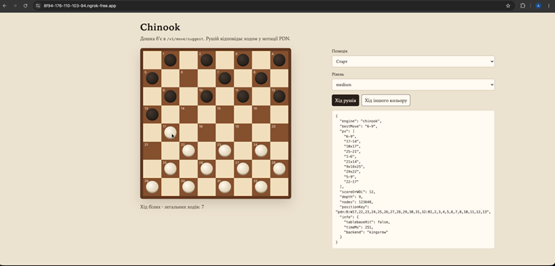
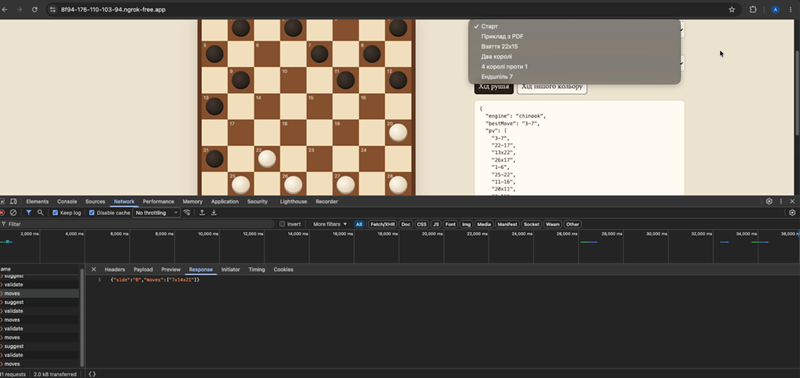

# Chinook Checkers REST API

ASP.NET Core 8 Web API for **English draughts (8×8 checkers)** move suggestion and validation. Designed to run under **IIS on Windows**, with optional **KingsRow** engine DLL and **Cake/Chinook-style endgame databases**.

Repository: [github.com/akr11/forChinook1](https://github.com/akr11/forChinook1)

## Features

- `POST /v1/move/suggest` — best move by level (`weak` / `medium` / `strong`) or custom time/depth limits
- `POST /v1/move/validate` — check whether a move is legal
- `GET /healthz` — liveness and worker count
- PDN position notation (e.g. `B:W18,22:B1,5`)
- Endgame probe when few pieces remain (`tablebaseHit`)
- Two long-lived engine workers, LRU response cache
- Simple board UI in `ChinookApi/wwwroot` for manual checks

## Demo videos

### API / health & suggest

[](demo/demo-api.mov)

[Watch demo-api.mov](demo/demo-api.mov)

### Board UI

[](demo/demo-board.mov)

[Watch demo-board.mov](demo/demo-board.mov)

## Requirements

- [.NET 8 SDK](https://dotnet.microsoft.com/download/dotnet/8.0)
- On Windows IIS deploy: [ASP.NET Core 8 Hosting Bundle](https://dotnet.microsoft.com/download/dotnet/8.0)
- Optional: [KingsRow](https://edgilbert.org/EnglishCheckers/KingsRowEnglish.htm) 64-bit engine (`Kingsrow64.dll`)
- Optional: Cake/Chinook WLD database files under `ChinookApi/db/` (**not in git** — ~4 GB; copy separately)

## Project layout

```
ChinookApi/           Web API + board UI
tests/                Unit / API tests
demo/                 Screen recordings
ChinookApi.slnx       Visual Studio solution
```

## Run locally

```bash
cd ChinookApi
dotnet run
```

Or open `ChinookApi.slnx` / `ChinookApi/ChinookApi.csproj` in **Visual Studio 2022** (17.13+) and press **F5**.

Then open the URL printed in the console (e.g. `http://localhost:5xxx`) and check:

```bash
curl http://localhost:5xxx/healthz
```

Expected: `{"ok":true,"workers":2}` (worker count may be `0` until engines start).

On **macOS/Linux**, set `Engine:Path` to `""` in `appsettings.json` (KingsRow is Windows-only). Search still works via the managed engine; tablebase needs the `db` folder.

## Deploy on IIS (Windows)

1. Publish:

   ```powershell
   dotnet publish ChinookApi\ChinookApi.csproj -c Release -o C:\inetpub\wwwroot\chinook
   ```

2. Copy endgame databases into `C:\inetpub\wwwroot\chinook\db` if required.
3. Point an IIS site at that folder (in-process ASP.NET Core module).
4. Set `Engine:Path` to your KingsRow DLL if installed, for example:

   `C:\Program Files (x86)\KingsRow\engines\Kingsrow64.dll`

5. Ensure the app-pool identity can read the engine folder and write under the site `logs` folder.
6. Open `http://<host>/healthz`.

To expose the LAN IIS site on the public Internet without a static IP, use a tunnel such as **ngrok** (`ngrok http 80`) while IIS is running.

## API

### `GET /healthz`

```json
{ "ok": true, "workers": 2 }
```

### `POST /v1/move/suggest`

```json
{
  "gameId": "checkers-8x8",
  "state": {
    "notation": "PDN",
    "position": "B:W18,19,22,25,27,28,30,32:B1,5,6,7,10,12,14,16"
  },
  "level": "strong",
  "limits": {
    "maxDepth": 18,
    "softTimeMs": 500,
    "hardTimeMs": 1200
  }
}
```

Levels (defaults):

| Level  | Depth | Soft time |
|--------|-------|-----------|
| weak   | 8     | 100 ms    |
| medium | 12    | 250 ms    |
| strong | 18    | 500 ms    |

Invalid PDN → **422**. Hard timeout → **504**.

### `POST /v1/move/validate`

```json
{ "position": "W:W22:B18", "move": "22x15" }
```

```json
{ "legal": true, "position": "B:W15:B" }
```

## Configuration (`ChinookApi/appsettings.json`)

| Key | Meaning |
|-----|---------|
| `Engine:Path` | Path to KingsRow `Kingsrow64.dll` (empty = managed search only) |
| `Engine:Workers` | Long-lived worker processes (default `2`) |
| `Engine:Databases` | Relative/absolute path to Cake DB folder (`db`) |
| `Cache:Capacity` / `TtlMinutes` | LRU cache size and TTL |
| `Limits:DefaultSoftTimeMs` / `DefaultHardTimeMs` | Default time bounds |

## Tests

```bash
dotnet test
```

Prefer filtered runs if a full suite is slow with large databases present.

## Notes

- Large `db/` and `publish/` outputs are gitignored.
- Under IIS, timed midgame searches typically use the **managed** engine so soft/hard limits stay reliable; KingsRow DLL can still be loaded when `Engine:Path` is set.
- Spec overview PDF is not stored in the repository (see `.gitignore`).
